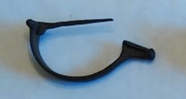

### Fibula Type
Aucissa
### Culture
Roman
### Period
 Roman Imperial
### Date
Early 2nd century CE
### Material
 Bronze
### Size
 L: 58.0mm, W: 9.0mm, D: 31.0mm
### Weight
 8.7g
### Description
 An aucissa fibula with some detailing on the bow of the fibula with a knob at the end of the foot. The pin appears to be broken at the end.

[Next]() |
