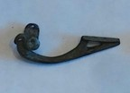

### Fibula Type
Colchester
### Culture
Roman
### Period
 Roman Imperial
### Date
1st Century CE
### Material
 Bronze
### Size
L: 44.5mm, W: Head- 14.5mm, Bow- 5.5mm, D: 13.5mm
### Weight
 7.3g
### Description
 This bow fibula has a sleeve spring system, and a short catch. There is also a loop at the top of the head of the fibula, and the pin is missing.

[Previous]() |
