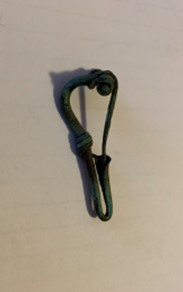

### Fibula Type
‘Bent-stem’
### Culture
Roman
### Period
Roman Imperial
### Date
Early 2nd Century CE
### Material
 Bronze
### Size
L: 44.0mm, W: Head-19.0mm, Bow- 3.0mm, D: 17.0mm
### Weight
 6.1g
### Description
 This fibula has the ‘bent-stem' features, and the metal is wrapped around about 3 times. The spring is a bit on the smaller side, and this gives the fibula a t-like shape.

[Previous]() | [Next]()
