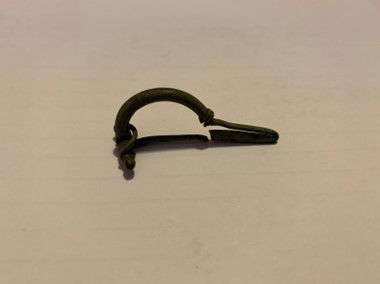

### Fibula Type
‘Bent-stem’
### Description
This ‘bent-stem' fibula has a much rounder bow shape, and the metal is wrapped around about 2 times. The pin is partially broken at the end.
### Culture
Roman
### Period
 Roman Imperial
### Date
 Early 2nd Century CE
### Material
 Bronze
### Size
 L: 46.0mm, W: Head- 18.5mm, Bow- 4.0mm, D: 16.0mm
### Weight
 5.9g

[Previous]() | [Next]()
