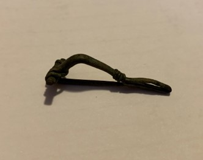

### Fibula Type
‘Bent-stem’
### Description
 This fibula has the features of a ’bent-stem' fibula, and the metal is wrapped around the foot about 4 times. The bow has more of a triangular-shaped area. It also has a very short/small spring.
### Culture
Roman
### Period
 Roman Imperial
### Date
2nd Century CE
### Material
 Bronze
### Size
 L: 40.5mm, W: Head- 17.0mm, Bow- 2.0mm, D: 12.0mm
### Weight
 3.1g

[Previous]() | [Next]()
