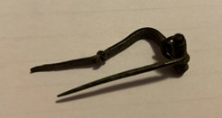

### Fibula Type
‘Bent-stem’
### Culture
Roman
### Period
 Roman Imperial
### Date
2nd Century CE
### Material
 Bronze
### Size
L: 43.0mm, W: Head- 15.0mm, Bow- 3.5mm, D: 15.0mm
### Weight
 3.5g
### Description
It looks like it was a ’bent-stem' fibula, but the catch was broken off. The spring is fairly short/small, and it looks like there are small knobs on the ends of the spring.

[Previous]() | [Next]()
