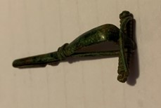

### Fibula Type
‘Bent-stem’
### Culture
Roman
### Period
 Roman Imperial
### Date
Mid 2nd Century CE
### Material
 Bronze
### Size
 L: 47.0mm, W: Head- 22.0mm, Bow- 6.0mm, D: 13.5mm
### Weight
 6.1g
### Description
 It looks like it was a ’bent-stem' fibula, but the catch was broken off. The spring is fairly short/small, and it looks like there are small knobs on the ends of the spring.

[Previous]() | [Next]()
