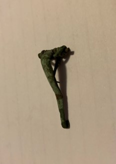

### Fibula Type
‘Bent-stem’
### Description
This fibula is fairly corroded, and appears to have had something covering part of the foot due to a less corrosive patch. It has a normal spring system.
### Culture
Roman
### Period
 Roman Imperial
### Date
Early 2nd Century CE
### Material
 Bronze
### Size
 L: 40.0mm, W: Head- 17.0mm, Bow- 4.0mm, D: 15.0mm
### Weight
 3.5g

[Previous]() | [Next]()
