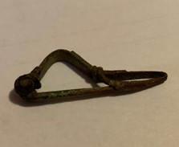

### Fibula Type
‘Bent-stem’
### Culture
Roman
### Period
 Roman Imperial
### Date
Mid 1st Century CE
### Material
 Bronze
### Size
L: 44.0mm, W: 5.0mm, D: 21.0mm
### Weight
4.0g
### Description
 This fibula has the ’bent-stem' features, and the metal wraps around about 2 times. The spring is very small, and the bow has a triangular-like shape.

[Previous]() | [Next]()
