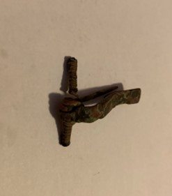

### Fibula Type
Early Spring Crossbow
### Culture
Roman
### Period
 Roman Imperial
### Date
Late 2nd Century CE
### Material
 Bronze
### Size
 L: 34.5mm, W: Head- 29.5mm, Bow- 5.5mm, D: 11.5mm
### Weight
 5.4g
### Description
This fibula has a rectangular shape foot, and it is very corroded. The spring is a long bilateral spring.

[Previous]() | [Next]()
