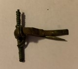

### Fibula Type
 Early Spring Crossbow
### Culture
Roman
### Period
 Roman Imperial
### Date
Early 3rd Century CE
### Material
 Bronze
### Size
L: 37.5mm, W: Head- 38.0mm, Bow- 3.5mm, D: 17.5mm
### Weight
 6.5g
### Description
This fibula has a rectangular-shaped foot, but it looks like it tapers a bit at the end. It also has a long bilateral spring. This makes the head as wide as it is long.

[Previous]() | [Next]()
