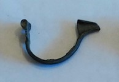

### Fibula Type
Aucissa
### Culture
Roman
### Period
 Roman Imperial
### Date
Early 2nd century CE
### Material
 Bronze
### Size
 L: 43.5mm, W: 9.0mm, D: 26.5mm
### Weight
5.9g
### Description
This aucissa fibula has line detailing on the bow of the fibula. It is also missing the pin.

[Previous]() | [Next]()
