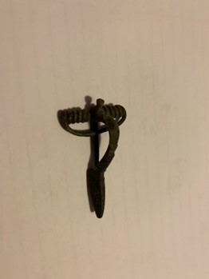

### Fibula Type
Early Spring Crossbow
### Description
This fibula resembles some parts of an early crossbow fibula. It has a knob at the top of the head, and has a large spring. There are some detailing marks like an “x" on the bow of the fibula.
### Culture
Roman
### Period
 Roman Imperial
### Date
Mid 3rd Century CE
### Material
 Bronze
### Size
 L: 53.5mm, W: Head- 31.0mm, Bow- 6.5mm, D: 12.5mm
### Weight
12.9g

[Previous]() | [Next]()
