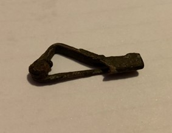

### Fibula Type
Early spring crossbow
### Culture
Roman
### Period
 Roman Imperial
### Date
 Late 2nd- early 3rd Century CE
### Material
 Bronze
### Size
 L: 36.0mm, W: 5.0mm, D: 19.0mm
### Weight
3.7g
### Description
This fibula appears to have the shape of a crossbow or a Kraftig Profiliert, which is very similar to a crossbow fibula shape. However it has gone through some rough deterioration, and the spring that makes the classic 't-shape' or 'crossbow-shape' has broken off over the years.

[Previous]() | [Next]()
