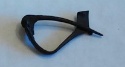

### Fibula Type
Tall-catch Aucissa
### Culture
Roman
### Period
 Roman Imperial
### Date
Late 1st Century CE
### Material
 Bronze
### Size
 L: 56.0mm,W: 6.5mm, D: 27.0mm
### Weight
9.8g
### Description
 This fibula has a slight triangular shape bow area, and has a large catch.

[Previous]() | [Next]()
