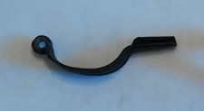

### Fibula Type
Aucissa
### Description
This fibula has line detailing along the bow, and some line detailing going across the foot of the fibula. It also is missing its pin.
### Culture
Roman
### Period
 Roman Imperial
### Date
 Mid 1st Century CE
### Material
 Bronze
### Size
L: 64.0mm, W: 10mm, D: 18.0mm
### Weight
7.8g

[Previous]() | [Next]()
