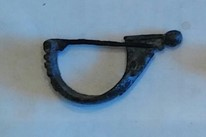

### Fibula Type
Aucissa
### Culture
Roman
### Period
 Roman Imperial
### Date
Early 2nd Century CE
### Material
 Bronze
### Size
  L: 50.5mm, W: 11.0mm, D: 24.5mm
### Weight
 12.1g
### Description
 This fibula has a nice rounded bow area, and has a line detail going down the bow with some rigid features on it as well, At the end of the foot is a knob.

[Previous]() | [Next]()
