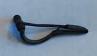

### Fibula Type
‘Bent-stem’
### Culture
Roman
### Period
 Roman Imperial
### Date
Mid 2nd Century CE
### Material
 Bronze
### Size
L: 67.0mm, W: Head- 26.5mm, Bow: 6.5mm, D: 22.0mm
### Weight
 16.6g
### Description
This “bent-stem’ fibula has a long foot that comes back around to wrap around itself where the bow and foot of the fibula meet

[Previous]() | [Next]()
