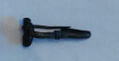

### Fibula Type
‘Bent-stem’
### Culture
Roman
### Period
 Roman Imperial
### Date
Late 2nd Century CE
### Material
 Bronze
### Size
 L: 47.0mm,W: Head- 21.0mm, Bow- 6.55mm, D: 9.5mm
### Weight
 7.1g
### Description
 This ‘bent-stem’ fibula has the foot of the fibula extend and ‘bend' back up to wrap around the foot again. This is that pattern of the wrapped metal around the foot.

[Previous]() | [Next]()
