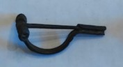

### Fibula Type
Early spring crossbow
### Description
This fibula has a medium bilateral spring, and lines detailed along the bow. It also has a long catch.
### Culture
Roman
### Period
 Roman Imperial
### Date
Early 3rd Century CE
### Material
 Bronze
### Size
 L: 63.5mm, W: Head- 33.0mm, Bow- 7.0mm, D: 22.5mm
### Weight
 19.3g

[Previous]() | [Next]()
