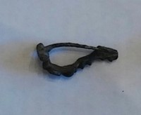

### Fibula Type
T-shape
### Culture
Roman
### Period
 Roman Imperial
### Date
Late 1st Century CE
### Material
 Bronze
### Size
  L: 32.0mm, W: 9.0mm, D: 13.5mm
### Weight
3.9g
### Description
 This is a fairly small fibula, and has a small catch at the foot. There are multiple ridges and ripples along the bow. At the peak arch of the bow there is a spherical-like shape design.

[Previous]() | [Last]()
